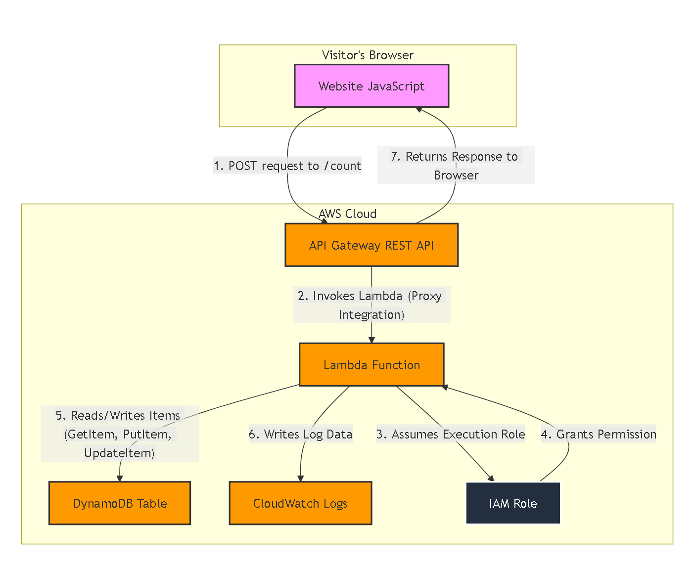

# Portfolio Backend Infrastructure

## Overview

This repository contains the Infrastructure as Code (IaC) for the serverless backend of my personal portfolio website demo at. This backend powers a secure, unique-visitor counter. The entire infrastructure is defined declaratively using Terraform and is deployed automatically via a CI/CD pipeline.

---

## Architecture

The backend is built on a serverless, event-driven architecture using core AWS services. This design is highly scalable, resilient, and extremely cost-effective.




---

## Features & Technology Stack

*   **API Endpoint:** A public REST API endpoint to receive visitor requests.
*   **Unique Visitor Tracking:** Uses HMAC-SHA256 hashing to pseudonymize visitor IP addresses, ensuring privacy while tracking unique visits.
*   **Serverless Compute:** All business logic is executed in a serverless environment, requiring no server management.
*   **Infrastructure as Code:** The entire stack is version-controlled and can be deployed or destroyed with a single command.

**Technology Stack:**
*   **Cloud Provider:** AWS (Amazon Web Services)
*   **Infrastructure as Code:** Terraform
*   **Database:** Amazon DynamoDB (NoSQL)
*   **Compute:** AWS Lambda (Python 3.13)
*   **API:** Amazon API Gateway (REST API)
*   **Security:** AWS IAM (Identity and Access Management)

---

## Setup and Deployment

This infrastructure is managed entirely by Terraform.

### Prerequisites

*   Terraform v1.x
*   An AWS Account
*   AWS CLI configured with appropriate credentials (via SSO or an IAM User)

### Deployment Steps

1.  **Clone the repository:**
    ```bash
    git clone https://github.com/arkhiVd/portfolio-backend.git
    cd portfolio-backend
    ```

2.  **Create a variables file:**
    Create a file named `terraform.tfvars` and add a random long secret for IP hashing:
    ```
    IP_HASH_SECRET = "your-super-long-and-random-secret-string"
    ```

3.  **Initialize Terraform:**
    This will download the required AWS provider.
    ```bash
    terraform init
    ```

4.  **Plan the deployment:**
    This will show you a preview of the resources that will be created.
    ```bash
    terraform plan
    ```

5.  **Apply the configuration:**
    This will build the infrastructure in your AWS account.
    ```bash
    terraform apply
    ```

Upon successful completion, the API invoke URL will be displayed as an output.

---
